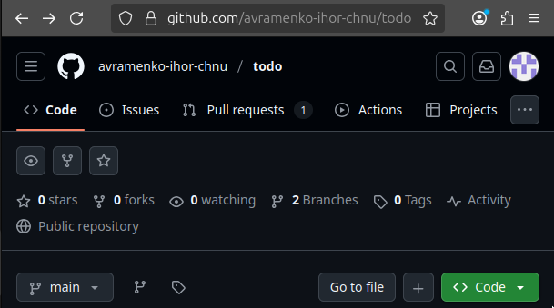
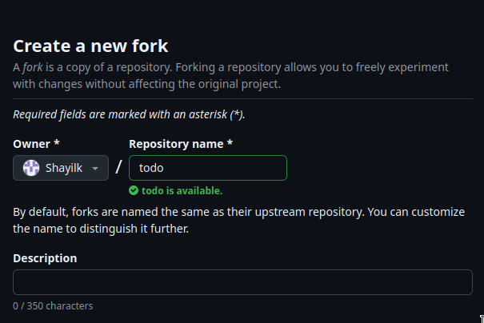
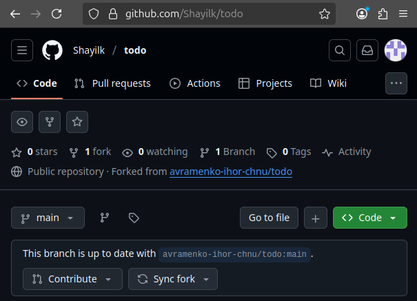
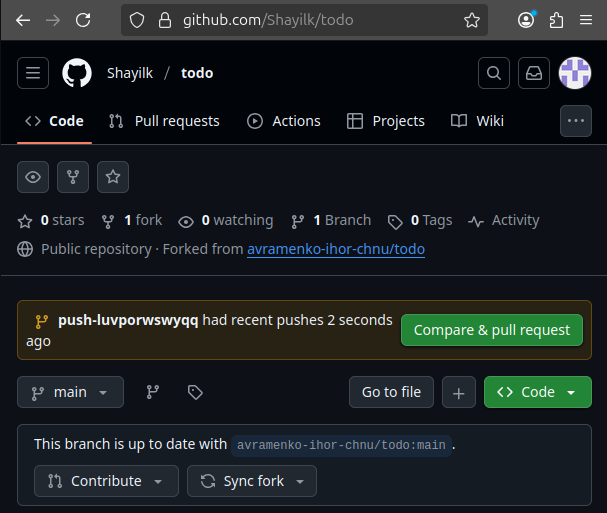
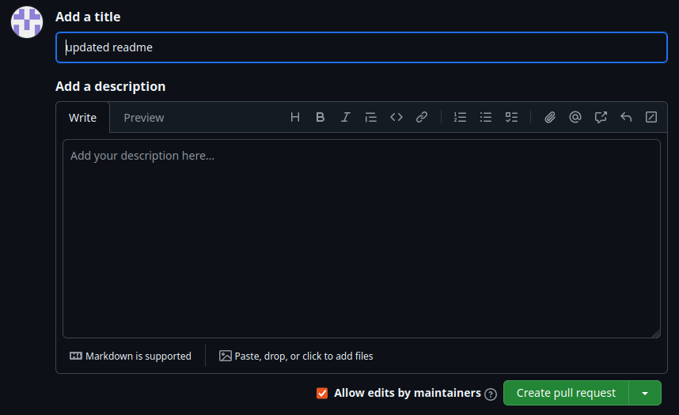
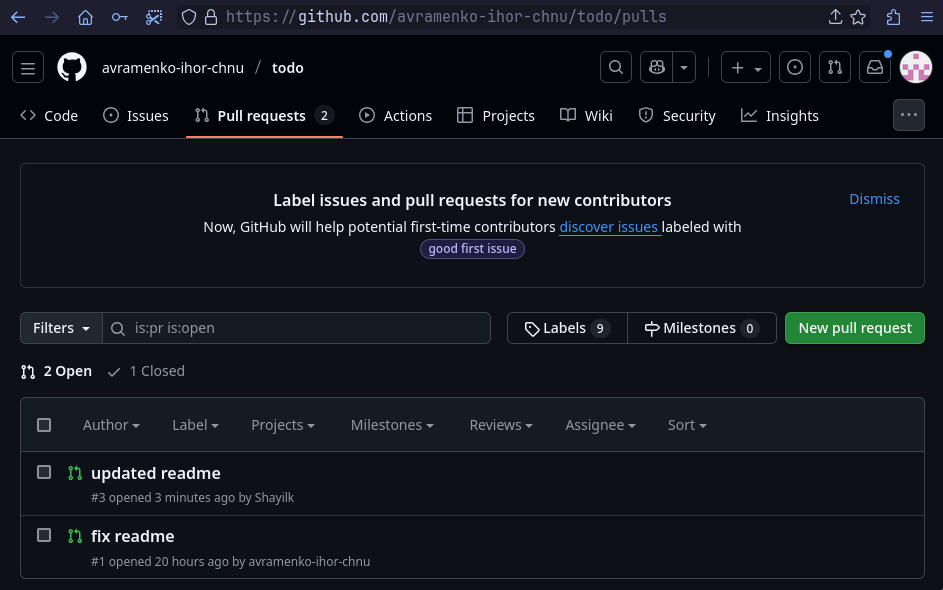
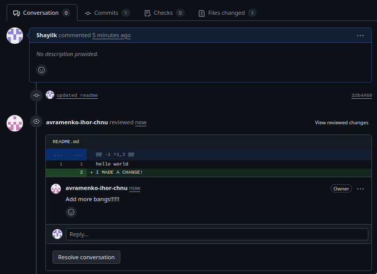

# Як зробити внесок

## Логін

Для роботи з GitHub вам варто автентифікуватися за допомогою клієнта `gh`.
Перевірте статус автентифікації за допомогою:

```sh
$ gh auth status
```

Якщо результат подібний до:

```sh
github.com
 ✓ Logged in to github.com account Shayilk (keyring)
 - Active account: true
 - Git operations protocol: https
 - Token: gho_**********
 - Token scopes: 'gist', 'read:org', 'repo', 'workflow'
```

То переходьте до наступної секції, інакше виконайте `gh auth login` та слідуйте інструкціям, які включатимуть автентифікацію через веб-браузер.

## Створіть форк (fork) репозиторію

Користуючись інтерфейсом GitHub, виконайте fork репозиторію.





Клонуйте ваш форк:

```sh
$ jj git clone https://github.com/Shayik/todo
```

## Працюйте над вашим форком

Вносьте зміни, які ви бажаєте зробити.
Наприклад, змініть `README.md` на такий вигляд:

```md
hello world
I MADE A CHANGE!
```

## Запуште ваші зміни до вашої гілки

Виконайте:

```sh
$ jj git push -c @
```

Це створить гілку з випадково згенерованою назвою та запушить поточні зміни до вашого форку.

Ви можете створити для ваших змін окрему назву, наприклад "fixed_readme":

```sh
$ jj bookmark create fixed_readme
$ jj git push fixed_readme
```

Але так, як вже зазначено у повідомленні коміту, ваші зміни в описі коміту просто продублюють вашу роботу.

Після того, як ви запушите ваші зміни, GitHub помітить зміни та запропонує створити `pull request`.
Слідуйте інтерфейсу для створення пулл-реквесту - я його отримаю та зможу прийняти його або надіслати фідбек.




Готово! Тепер власник побачить наші зміни.



## Реагуємо на фідбек



Подивіться, ми отримали фідбек від власника репозиторію, давайте на нього відреагуємо.

Створімо новий коміт з назвою "response to feedback":

```sh
$ jj new -m "response to feedback"
```

Ви побачите:

```
Working copy now at: nzsvmmzl 3b663200 (empty) response to feedback
Parent commit      : vmunwxsk 9410db49 push-vmunwxsksqvk | updated readme
```

І змініть `README.md`:

```md
hello world
I MADE A CHANGE!!!!!!!!!
```

Наша зміна готова, але ми дещо забули:

```sh
$ jj log
```

```
@  nzsvmmzl avramenkoihor.u@gmail.com 2024-03-02 09:22:40.000 -06:00 ad6b9b14
│  response to feedback
◉  vmunwxsk avramenkoihor.u@gmail.com 2024-03-02 08:27:30.000 -06:00 push-vmunwxsksqvk 9410db49
│  updated readme
◉  ksrmwuon avramenkoihor.u@gmail.com 2024-03-01 23:10:35.000 -06:00 main e202b67c
│  initial commit
~
```

Пам'ятайте, `jj new` не переміщує закладки (гілки), тому якщо ми просто запушимо, нічого не станеться:

```sh
$ jj git push
```

```
Warning: No bookmarks found in the default push revset: remote_bookmarks(remote=origin)..@
Nothing changed.
```

Спочатку нам варто оновити закладку до нашого нового коміту, а потім запушити:

```sh
$ jj bookmark set push-vmunwxsksqvk
```

```
Moved 1 bookmarks to nzsvmmzl ad6b9b14 push-vmunwxsksqvk* | response to feedback
```

```sh
$ jj git push
```

```
Changes to push to origin:
  Move forward bookmark push-vmunwxsksqvk from 9410db49f9ba to ad6b9b149f88
```

Коли люди вперше дізнаються про таку поведінку, вони часто трохи роздратовані. Здається, що потрібно робити додатковий крок кожного разу, коли ви змінюєте свій пулл-реквест. Але на практиці я виявив, що ця додаткова робота більше впливає на маленькі PR, ніж на великі. Справжня зміна у підході полягає в тому, щоб переконатися, що ваша гілка вказує туди, куди ви хочете, безпосередньо перед пушем, а не після кожного коміту. Іншими словами, робочий процес виглядає не так:

- Зробити зміну
- Оновити гілку
- Зробити зміну
- Оновити гілку
- Запушти

А так:

- Зробити зміну
- Зробити зміну
- Оновити гілку
- Запушти
